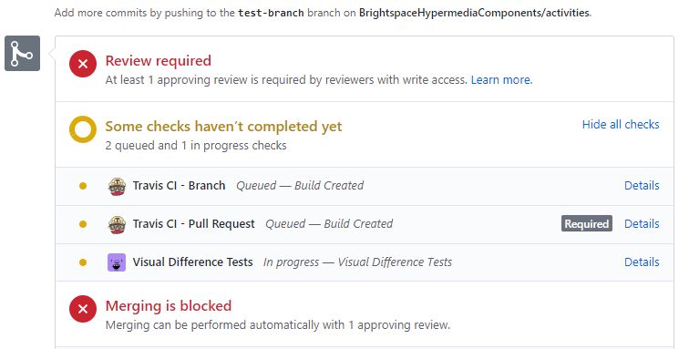

# visual-difference-bot

[](https://travis-ci.com/BrightspaceUI/visual-difference-bot)

> A GitHub App built with [Probot](https://github.com/probot/probot) that comments on PRs when Visual Difference checks fail.

# Table of Contents

- 1 - [Deploying your own instance of the Bot](README.md/#deploying-your-own-instance-of-the-bot)
  - 1.1 - [Dependency Installation and Running the Bot Locally](README.md/#dependency-installation-and-running-the-bot-locally)
  - 1.2 - [Creating your own GitHub app](README.md/#creating-your-own-github-app)
  - 1.3 - [Testing Bot Locally](README.md/#testing-bot-locally)
  - 1.4 - [Repository Configuration](README.md/#repository-configuration)
  - 1.5 - [Secrets Management](README.md/#secrets-management)
  - 1.6 - [Serverless Deployment to AWS Lambda](README.md/#serverless-deployment-to-aws-lambda)
- 2 - [Utilizing the Deployed Bot for your Existing Brightspace Repo](README.md/#utilizing-the-deployed-bot-for-your-existing-brightspace-repo)
  - 2.1 - [Setting Up the Bot on your existing Brightspace Repo](README.md/#setting-up-the-bot-on-your-existing-brightspace-repo)
- 3 - [Other](README.md/#other)
  - 3.1 - [Screenshots](README.md/#screenshots)
  - 3.2 - [Tests](README.md/#tests)
  - 3.2 - [Contributing](README.md/#contributing)
  
# Deploying your own instance of the Bot

**These instructions are for *deploying your own instance* of the Visual-Difference Bot or *updating the existing instance* of the Bot. It is *highly recommended* you use the *already deployed instance* of the Bot. Instructions for that are [here](README.md#utilizing-the-deployed-bot-for-your-existing-brightspace-repo).**

## Dependency Installation and Running the Bot Locally

```sh
# Install dependencies.
npm install

# Run the bot.
npm start

# Run the bot in development mode (will automatically restart on code changes).
npm run dev
```

## Creating your own GitHub app

1. Run the application in development mode.
2. Visit `http://localhost:3000` and then authenticate with GitHub.
3. Be sure to update the **Webhook URL** in the **application settings on GitHub.**

## Testing Bot Locally

You can test the bot locally on your own machine using [ngrok](https://ngrok.com/).

1. Start the bot:
```sh
npm run dev
```
2. Start the ngrok tunnel:
```sh
ngrok http 3000
```
3. Be sure to change the **Webhook URL** in the **GitHub application settings to be your ngrok tunnel URL**.
4. Create a GitHub event to trigger the bot.

## Repository Configuration

In order to have this bot watch the Visual Difference tests for a specific repo, you need to have a custom Travis CI configuration.

1. Ensure that your repository is setup with the [visual-diff package](https://github.com/BrightspaceUI/visual-diff).
2. Make sure that the GitHub application is [installed on the desired repo](README.md/#setting-up-the-bot-on-your-existing-brightspace-repo).
3. Modify your Travis CI config so that it has the following `jobs/stages` section.

```yaml
jobs:
  include:
  - stage: code-tests-or-whatever-name-you-want
    script:
    - npm run lint
    - do-some-other-tests
  - stage: visual-difference-tests
    script:
    - |
      if [ $TRAVIS_SECURE_ENV_VARS == true ]; then
        echo "Running visual difference tests...";
        npm run test:diff || travis_terminate 1;
      fi
  - stage: update-version
    script: frauci-update-version && export TRAVIS_TAG=$(frauci-get-version)
```

**Make sure you have the appropriate Travis secure environment variables required by the [visual-diff package](https://github.com/BrightspaceUI/visual-diff#running-in-ci), you need to use `travis encrypt` to add these to your travis config.**

```yaml
env:
  global:
  # VISUAL_DIFF_S3_ID
  - secure: TOKEN
  # VISUAL_DIFF_S3_SECRET
  - secure: TOKEN
```

4. The important thing to note above, is that the jobs have been split into multiple stages. The first stage is the normal tests you want to run (with whatever name you would like it to be). The second stage is the important one (it must be the second stage) and the name must be named `visual-difference-tests`. This is what the bot will use to check the status of your Visual Difference tests.

**Warning:**
If your repo is using the `after_success`, `after_script`, etc. options to create a release and increment versions (frauci-update-version), this script needs to be moved into it's own stage (it can be named anything, but in the example above it is `update-version`). **If this stage isn't created, that script will get run twice after the completion of each stage, which results in your version being incremented twice.**

If putting this script in it's own stage, causes the build to fail, then you can go back to using `after_success` as long as you encapsulate the script with the if-check shown below.

```yaml
after_success:
- |
  if [ $TRAVIS_BUILD_STAGE_NAME == "Visual-difference-tests" ]; then
    frauci-update-version -d=skip && export TRAVIS_TAG=$(frauci-get-version)
  fi
```

## Secrets Management

1. Create a .env file (see [example](.env.example)) with the appropriate values for your situation.
2. The `deploy.py` script will use this file to create the same environment variables for the deployed Lambda.

## Serverless Deployment to AWS Lambda

1. Ensure that you have Python 3.7.X installed on your system.
2. Ensure that you have created a [.env file](README.md/#secrets-management).

```sh
# Install serverless.
npm install -g serverless

# Install the python3 deploy script dependencies.
pip3 install -r requirements.txt

# To deploy a new stack to AWS/update the existing one (Requires your AWS credentials to be set).
python3 deploy.py

# Remove the existing stack from AWS.
python3 deploy.py --remove-stack

# Spy on the CloudWatch logs as they come in (for debugging purposes).
# Output the serverless template and quit (dry mode).
python3 deploy.py -d
# View the logs
serverless logs -f probot -t
```

3. Be sure to update the **Webhook URL** in the **application settings on GitHub** to be the URL of the API Gateway for the Lambda function.

# Utilizing the Deployed Bot for your existing Brightspace Repo

**These instruction are for *enabling* the *currently deployed Bot* on your repository.**

## Setting Up the Bot on your Existing Brightspace Repo

1. **Install** the application and grant it access to your repository - The app is owned by the BrightspaceUI organization and this link should let you [**install it on your repo**](https://github.com/apps/visual-difference).
2. **Modify your repository's Travis CI config** according to the [**Repository Configuration Instructions**](README.md/#repository-configuration) and merge the changes to master.
3. [Write Visual Difference tests](https://github.com/BrightspaceUI/visual-diff#usage) and merge them to master.
4. Done!

# Other

## Screenshots



## Tests

Tests for this project are written with [Jest](https://facebook.github.io/jest/) and [Nock](https://github.com/nock/nock).

## Contributing

Contributions are welcome, please submit a pull request!
